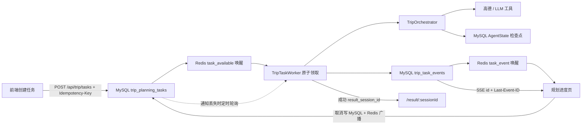

# 阶段五：异步旅行规划任务运行时

## 1. 目标

阶段五把原来必须等待同步 HTTP 请求完成的旅行规划，升级为可持久化、可恢复、可取消的后台任务，同时保留 `POST /api/trip/plan` 兼容旧客户端。

核心设计不是 FastAPI `BackgroundTasks`，而是 **可切换持久化队列（当前为 MySQL）+ Worker 租约 + AgentState 检查点 + 可回放 SSE 事件**。因此浏览器刷新、网络断开和服务进程重启都不会丢失任务身份或执行状态。

## 2. 组件



- `app/task_runtime/store.py`：任务、幂等键、事件、租约和终态持久化。
- `app/task_runtime/notifying_store.py`：数据库提交后的 best-effort 通知装饰器。
- `app/infrastructure/notifications/`：进程内 Worker/SSE/取消唤醒协调器和 NoOp 降级实现。
- `app/infrastructure/redis/task_notifications.py`：Redis Pub/Sub 发布、单订阅线程和自动重连。
- `app/task_runtime/worker.py`：后台领取、心跳、恢复、取消和失败报告。
- `app/task_runtime/context.py`：通过 `ContextVar` 把取消和租约检查注入同步 Orchestrator。
- `app/task_runtime/progress.py`：业务阶段名称与单调进度映射。
- `main.py`：任务 REST API、SSE 和 FastAPI 生命周期。

## 3. API 契约

### 创建任务

```http
POST /api/trip/tasks
Idempotency-Key: <客户端生成并在网络重试时复用的值>
```

返回 HTTP 202。相同幂等键和相同请求返回原任务；即使双击时生成了不同键，相同请求的活动任务仍会被复用。

### 查询任务

```http
GET /api/trip/tasks/{task_id}
```

页面刷新、重新打开或 SSE 不可用时，以该持久化快照为准。

### 取消任务

```http
POST /api/trip/tasks/{task_id}/cancel
```

排队任务立即进入 `cancelled`；执行中任务写入取消标记。Orchestrator 在每轮动作、每个压缩子动作、每次退避等待和每次高德/LLM 调用前检查取消状态。

### 订阅事件

```http
GET /api/trip/tasks/{task_id}/events
Last-Event-ID: <最后已消费事件 ID>
```

也可使用 `after_event_id` 查询参数。事件 ID 来自当前持久化后端的单调自增主键（MySQL 使用 `BIGINT UNSIGNED AUTO_INCREMENT`），服务端只回放严格大于游标的事件，前端再用 event ID 集合做二次去重。

## 4. Worker 互斥与服务重启恢复

1. Worker 使用 `BEGIN IMMEDIATE` 和条件更新原子领取 `queued`、`retrying` 或租约过期的 `running` 任务。
2. 执行期间由独立心跳线程续租。
3. 每个外部工具调用和 AgentState 检查点前都验证租约归属；旧 Worker 失去租约后不能继续写进度、调用下一个供应商或覆盖终态。
4. 服务重启后，新 Worker 等旧租约过期，再以同一个 `session_id` 加载最近的 AgentState 检查点并调用 `resume()`。
5. 默认租约为 30 秒，因此异常重启后的恢复延迟上限通常接近 30 秒；这是避免双 Worker 同时执行的安全窗口。

## 5. 取消边界

取消采用协作式安全停止：

- 尚未开始的高德或 LLM 调用不会再发出；
- 指数退避被切成短时间片，可快速响应取消；
- 已经发送出去的同步 HTTP 请求不能被 Python 安全强杀，需要等待该请求返回或 HTTP 超时；
- 请求返回后会再次检查取消标记，不会继续下一次外部调用；
- 任务和 AgentState 最终都会标记为 `cancelled`。

## 6. 失败报告

失败终态保存 `failure_report`，包含：

- 稳定错误码与异常类型；
- 当前阶段、动作、步骤和最大步骤；
- 是否可重试；
- Provider 错误码和错误信息；
- session ID、任务尝试次数和恢复次数；
- 超时任务使用 `timed_out` 状态，其余不可恢复错误使用 `failed`。

## 7. 配置

```env
TRIP_TASK_WORKER_ENABLED=true
TRIP_TASK_WORKER_POLL_SECONDS=0.5
TRIP_TASK_LEASE_SECONDS=30
TRIP_TASK_HEARTBEAT_SECONDS=5
TRIP_TASK_SHUTDOWN_TIMEOUT_SECONDS=3
TRIP_TASK_SSE_POLL_SECONDS=0.5
TRIP_TASK_SSE_HEARTBEAT_SECONDS=15
REDIS_TASK_NOTIFICATIONS_ENABLED=true
REDIS_TASK_NOTIFICATION_RECONNECT_SECONDS=1
TRIP_TASK_NOTIFICATION_WORKER_FALLBACK_POLL_SECONDS=5
TRIP_TASK_NOTIFICATION_SSE_FALLBACK_POLL_SECONDS=5
```

生产环境应保证 `TRIP_TASK_LEASE_SECONDS` 明显大于心跳间隔和预期数据库短暂阻塞时间。

## 8. 兼容性

- 原同步 `POST /api/trip/plan` 保留，且不绑定 TaskContext，不会产生异步事件。
- 会话查询、恢复、execution-view 继续使用原 `session_id`。
- 第四阶段 TripDraft、重新评估和 TripPlanVersion 路由、存储与服务保持不变。
- 前端成功后使用任务返回的 `result_session_id` 自动跳转 `/result/:sessionId`。


## 9. Redis 通知与数据库兜底

通知链路遵循“**先提交数据库，再发布 Redis**”：

1. 创建任务成功后发布 `task_available`，跨进程唤醒 Worker；
2. `claim_next`、进度和终态事件写库成功后发布 `task_event`，SSE 被唤醒后仍按 `event_id` 查询数据库；
3. 取消标记写库成功后发布 `cancellation`，执行上下文优先检查本地取消信号，然后继续保留数据库检查；
4. Redis 消息重复不会重复展示事件，因为浏览器输出只来自数据库中严格大于游标的事件；
5. Redis 发布失败、订阅断线或消息丢失时，Worker 和 SSE 等待超时后自动查询 MySQL/SQLite；
6. Redis 不保存唯一任务状态，不参与 Worker 租约互斥，也不替代 AgentState 检查点。

应用只建立一个 Redis Pub/Sub 订阅线程，再把消息转换为进程内 `Condition`，不会为每个 SSE 连接创建一条 Redis 长连接。

`GET /api/health` 的 `components.redis_notifications` 提供订阅状态和以下指标：

- 发布、接收和发布降级次数；
- Worker 通知唤醒与数据库兜底超时；
- SSE 通知唤醒与数据库兜底超时；
- 取消快速路径命中和数据库取消检查次数；
- 非法消息和订阅重连次数。

## 10. 跨进程故障恢复验收

异步运行时提供独立的真实验收脚本，验证多进程行为，不调用高德和 LLM：

```powershell
.\.venv\Scripts\python.exe scripts\run_redis_runtime_acceptance.py `
  --database travel_agent_test `
  --json-report build\reports\redis-runtime-acceptance.json
```

该脚本覆盖：

- Redis Pub/Sub 跨进程任务、事件和取消通知；
- 三个 MySQL Worker 并发领取及租约互斥；
- Redis 故障期间的数据库兜底和恢复后的自动重连；
- 跨进程取消、真实 SSE 路由、`Last-Event-ID` 回放及重复通知去重。

MySQL 仍是任务状态、取消标志、Worker 租约和 SSE 事件的唯一事实来源。Redis 验收失败或运行期不可用只会降低唤醒速度，不能改变数据库事实或阻断任务轮询。脚本会拒绝正式 `MYSQL_DATABASE`，必须使用独立 `MYSQL_TEST_DATABASE`。


## 11. Redis 生产可观测性与轮询调优

任务通知运行时现在同时提供：

- Prometheus Worker/SSE 通知唤醒、数据库兜底和通知降级指标；
- `/api/observability/redis` 连接池、订阅状态和结构化告警；
- Redis Pub/Sub 端到端压力脚本；
- 根据通知接收率和端到端 P95 生成轮询间隔建议。

2026-08-21 本机 20 并发基线中，通知接收率为 100%，端到端 P95 为 0.262ms。因此当前继续使用 Worker 5 秒、SSE 5 秒数据库兜底；Redis 正常时仍由 Pub/Sub 立即唤醒，不会等待 5 秒。详细结果见 `docs/redis-production-observability.md`。
