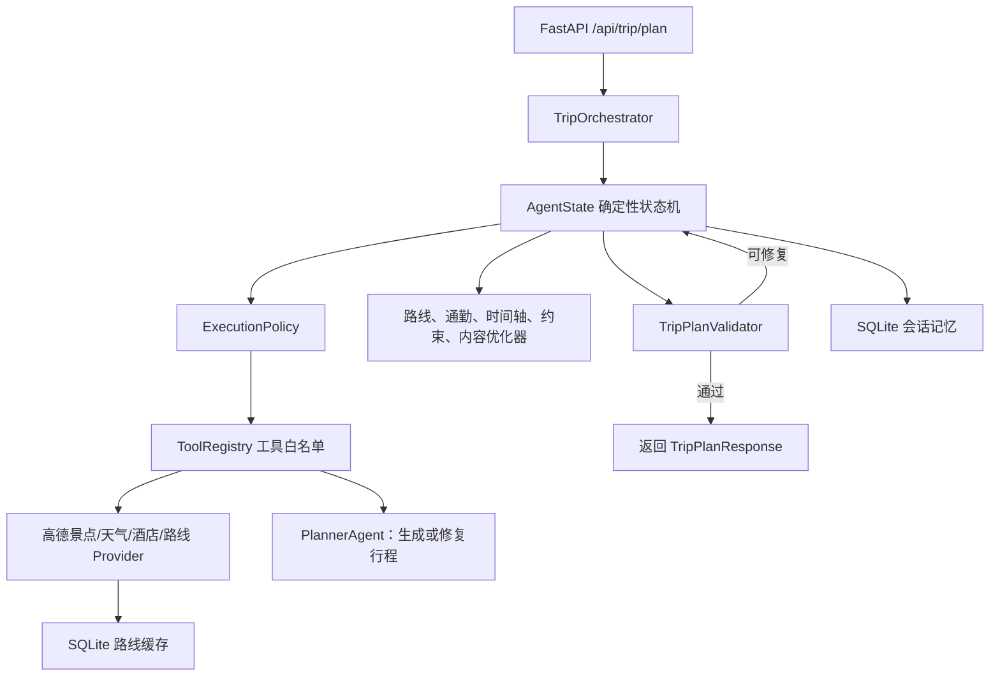

# 旅行规划智能体：现有能力与后续规划

## 1. 项目定位

本项目是一个基于 FastAPI 的旅行规划后端，也是一套**有状态、可恢复、有边界的确定性智能体运行时**。

它不是让 LLM 任意决定和执行命令的完全自主 Agent。当前架构把职责拆成两部分：

- **LLM**：负责首次生成结构化行程，以及在确定性校验无法直接修复时进行有限次数的行程修复。
- **确定性运行时**：负责状态决策、工具调用、路线评估、日程优化、约束修复、预算控制、缓存、记忆和审计。

这种设计优先保证稳定性、可解释性和可测试性，再逐步增加受约束的自主决策能力。

## 2. 总体架构

## 3. 一次规划请求的主要步骤

主流程位于 `app/agent_runtime/orchestrator.py`。每轮先根据 `AgentState` 选择一个物理根动作，再把后续连续的确定性本地动作压缩到同一物理步骤，并在该物理步骤结束后保存检查点。

1. 创建或恢复 `AgentState`，固化最大步骤、修复次数和执行预算。
2. 直接调用高德工具搜索景点、天气和酒店，不再为事实查询增加无必要的 LLM 调用。
3. 调用规划模型生成满足 `TripPlan` Schema 的初始行程。
4. 查询酒店与景点、景点与景点之间的高德真实路线。
5. 对路线完整性、不可用分段、总时长和总距离进行质量评分。
6. 路线质量较差时，用确定性候选排序优化景点顺序，并通过真实路线复验后决定接受或回滚。
7. 评估每一段通勤时长；过远时优先从本地候选池替换景点。
8. 本地候选不足时，根据前后地点计算搜索中心，动态调用高德周边搜索补充候选池。
9. 对补充候选执行标准化、去重、排序、裁剪，再次尝试近距离替换和真实路线复验。
10. 构建包含酒店出发、景点、用餐窗口和酒店返回的完整时间轴。
11. 发现每日超时时，执行有界跨日日程优化，并重新查询路线和评估时间轴。
12. 评估营业时间、天气、午餐窗口、每日景点软上限等可执行性约束。
13. 对可修复冲突执行确定性优化，并对修改后的行程重新评估。
14. 最终景点不足时，从附近未使用候选中回填，且不能引入已知日程失败。
15. 根据最终酒店、景点和真实路线重建描述、餐饮、交通说明和预算，消除派生内容不一致。
16. 执行确定性语义校验；必要时把结构化问题交给 LLM 做有限次数修复。
17. 校验通过后结束会话，返回行程、会话 ID 和实际执行步数。

## 4. 已经具备的功能

### 4.1 API 与领域模型

- FastAPI 旅行规划接口：`POST /api/trip/plan`。
- 工具白名单查询：`GET /api/agent/tools`。
- 会话列表、详情和恢复接口。
- 状态跳转路径与完成率基线查询接口。
- Pydantic 请求、行程、路线、时间轴、约束和响应模型。
- 阶段、步骤、尝试次数和会话 ID 都会进入错误信息，方便定位失败位置。

### 4.2 多协议 LLM 客户端

- OpenAI Responses API 协议。
- Anthropic Messages API 协议。
- 兼容部分中转网关的文本块和 `tool_use` 返回结构。
- JSON 提取、Markdown 代码块清理、TripPlan 结构校验和输出截断诊断。
- LLM 只承担生成与有限修复，不直接执行任意命令。

### 4.3 AgentState 与确定性循环

- 显式 `AgentAction` 状态机。
- 有最大步骤限制的循环执行，防止无限循环。
- 每个动作记录开始、成功、失败、耗时、错误类型和重试信息。
- 支持从 SQLite 最近检查点恢复，不重复已成功动作。
- 保存路线、评估报告、优化次数、内容指纹和动作历史。

### 4.4 执行循环收敛

- 对动作业务输入生成稳定 SHA-256 指纹，在消耗步骤和工具预算前阻断相同动作、相同输入的重复成功执行。
- 路线质量、单段通勤、时间轴、可执行性约束和最终校验分别维护完整评估输入指纹；只有依赖输入发生变化才重新评估。
- 对动作前后的核心业务状态生成指纹，统计连续成功但没有改变业务状态的无收益步骤，并在达到阈值时提前终止。
- 失败重试不计入重复动作和无收益次数，不干扰指数退避与熔断流程。
- 业务状态产生有效变化后开启新的收敛窗口，允许修复、回滚后合法地重新执行必要动作。
- 收敛原因、动作输入指纹、状态前后指纹和是否产生进展均写入 SQLite，支持恢复和复盘。
- 收敛终止通过 HTTP 409 返回明确的阶段、步骤、会话 ID 和原因。

### 4.5 状态跳转压缩

- `current_step` 只统计物理循环步骤，`action_history` 继续保存完整逻辑动作历史。
- HTTP 和 LLM 动作不能作为压缩子动作，必须开启新的物理步骤；外部动作成功后，路线、通勤、时间轴、约束、内容重建、校验和结束等确定性本地动作可以继续吸收到当前步骤。
- 每个压缩子动作仍保留独立 `ActionRecord`、输入指纹、状态前后指纹、收敛判断和尝试次数。
- 根动作记录本批次吸收的 `compressed_actions`；子动作记录根动作、批次序号和共享步骤号，便于 SQLite 恢复与复盘。
- 单个物理步骤最多吸收 `AGENT_MAX_LOCAL_ACTIONS_PER_STEP` 个本地动作，达到上限后由下一物理步骤继续，避免批次内部无限循环。
- 当前基础成功路径保留 10 个逻辑动作，但物理步骤已从 10 步压缩到 5 步，SQLite 常规检查点也按物理步骤写入。

### 4.6 状态跳转路径与完成率基线

- 只读统计接口：`GET /api/trip/analytics/execution-baseline`，不会调用高德、LLM 或修改会话。
- 支持按城市、会话状态和最近样本数量过滤，并返回匹配数、实际分析数、截断状态和无效旧检查点数量。
- 统计整体及各城市的完成率、平均物理步骤、平均逻辑动作和步骤压缩率。
- 统计每类动作的执行次数、覆盖会话数、成功/失败次数、压缩次数和平均耗时。
- 统计相邻动作跳转，并区分同一物理步骤内跳转和跨物理步骤跳转。
- 当动作序列再次回到旧动作时识别循环路径，可通过 `max_cycle_span` 控制最大循环跨度。
- 常见跳转和循环按出现次数排序，为后续“部分可接受结果”策略提供可量化依据。
### 4.7 ToolRegistry 与统一 ActionResult

- 工具必须先注册到白名单才能执行。
- 统一输入校验、输出校验、异常分类和安全错误信息。
- 工具声明自身 LLM 调用成本，运行时统一扣减预算。
- 当前白名单包含：景点搜索、周边候选补搜、天气查询、酒店查询、真实路线查询、行程生成和行程修复。

### 4.8 执行安全与容错

- 总执行时长预算。
- 工具调用次数预算。
- LLM 调用次数预算。
- HTTP 连接超时和读取超时。
- 指数退避与随机抖动。
- 按工具隔离的线程安全 CircuitBreaker。
- 鉴权、参数等不可恢复错误不会被无意义重试。

### 4.9 高德地图工具层

- 景点关键词搜索。
- 酒店搜索。
- 天气查询。
- 周边 POI 动态补充搜索。
- Route Planning 2.0 真实路线查询。
- 公交路线所需 citycode 解析。
- Provider 原始输出标准化、无效项过滤、去重、排序和裁剪。
- 路线分段失败时保留其他成功分段，不因单段失败丢弃整份路线结果。

### 4.10 SQLite 记忆与缓存

- 完整 `AgentState` 检查点持久化。
- 会话查询、恢复和复盘。
- 动作历史、错误历史和验证历史保存。
- 标准化路线结果 SQLite 缓存。
- 正常路线与不可用路线使用不同 TTL，减少重复请求并避免长期缓存临时故障。

### 4.11 路线质量与优化

- 高德真实路线质量评分。
- 酒店出发和返回路线。
- 不可用分段、总路程、总时长和完整率评估。
- Haversine 生成候选顺序，真实路线负责最终验收。
- 优化结果没有达到最小改善阈值时自动回滚。

### 4.12 单段通勤约束

- 按步行、公共交通和驾车分别配置最大单段通勤时间。
- 定位具体超限分段和目标景点。
- 根据前后锚点选择距离更近的未使用景点。
- 本地候选不足时动态扩大高德周边搜索半径。
- 替换后重新查询真实路线、时间轴和可执行性约束，失败则回滚。

### 4.13 时间轴与日程优化

- 完整地点时间轴：酒店出发、景点、午餐、晚餐和酒店返回。
- 游览时间、真实通勤时间和缓冲时间统一计算。
- 每日超时和不可执行日期识别。
- 有界跨日移动优化。
- 优化后重新进行路线和约束评估。

### 4.14 可执行性约束与内容一致性

- 日期和天数一致性。
- 景点来源和重复项检查。
- 营业时间、天气、用餐窗口和每日景点数量检查。
- 最低景点数量保障与附近候选回填。
- 描述、餐饮、交通和预算根据最终行程重新构建。
- 使用内容源指纹避免无意义重复重建。

### 4.15 测试覆盖

测试覆盖高德标准化、工具注册、执行策略、会话记忆、路线缓存、路线优化、通勤替换、时间轴优化、约束修复、内容回填、规划模型解析、执行循环收敛、状态跳转压缩和执行基线聚合。

## 5. 当前边界与已知问题

1. **跨外部调用的循环仍可能增加步骤**：状态跳转压缩已经合并连续本地评估，但“替换景点 → 查询真实路线 → 复验 → 再优化”等包含高德或 LLM 调用的循环仍必须占用独立物理步骤，现在可以根据执行基线定位高频循环，并通过部分可接受结果策略继续提高完成率。
2. **还不是真正的 LLM 自主规划器**：当前自主性来自确定性状态机。这样更安全，但不能根据复杂上下文灵活选择新策略。
3. **餐饮仍偏规则生成**：项目会生成用餐时间窗口和一致性餐饮信息，但还没有独立的真实餐厅检索、营业状态和预订能力。
4. **费用是估算值**：门票、酒店、餐饮和交通价格仍需更可靠的数据源与价格时间戳。
5. **天气属于查询时快照**：远期旅行日期可能没有可靠预报，应显式区分预报、历史气候和未知状态。
6. **可观测性主要在状态历史中**：还缺少统一指标、日志追踪和可视化面板。
7. **端到端评测城市不足**：需要固定测试集持续验证不同城市、天数和交通方式。
8. **同步外部调用较多**：FastAPI 已通过线程池避免阻塞事件循环，但大规模并发时还需要任务队列、限流和异步化设计。

## 6. 后续工作计划

### 阶段一：压缩执行步骤并提高完成率（最高优先级）

目标：解决“达到最大执行步数仍未完成”的问题，而不是单纯继续增大 `AGENT_MAX_STEPS`。

已完成：

- 已为路线、通勤、时间轴、约束和最终校验建立完整评估输入指纹，输入未变化时不重复评估。
- 已阻断同一收敛窗口内“相同动作 + 相同业务输入”的重复成功执行。
- 已通过业务状态前后指纹识别连续无收益动作，并在达到阈值时提前终止。
- 已将收敛历史持久化到 SQLite；失败重试不计入收敛次数，合法修复和回滚会开启新窗口。
- 已把连续确定性本地动作压缩到同一物理步骤，同时保留每个逻辑动作的审计、收敛记录和 SQLite 恢复能力。
- 已从 SQLite `action_history` 建立动作次数、相邻跳转、常见循环、城市完成率和平均物理步骤基线，并提供只读查询 API。

下一步：

- 从 SQLite `action_history` 统计每类动作次数和状态跳转路径，建立固定完成率基线。
- 增加“部分可接受结果”策略：在非关键告警无法消除时允许带告警完成，而不是耗尽全部步骤。

验收指标：典型 3 日行程在物理步骤预算内稳定完成；没有重复输入的同类评估动作；逻辑动作审计数量不因压缩而减少。

### 阶段二：端到端可观测性

- 结构化日志和 request/session 关联 ID。
- 每阶段耗时、工具调用次数、LLM 调用次数和重试次数。
- 路线缓存命中率、候选池增量、熔断器状态。
- 每个优化器的优化前后评分与接受/回滚原因。
- 提供会话执行时间线查询接口或调试页面。

### 阶段三：固定质量评测体系

建立杭州、北京、上海、成都、西安等固定样例，至少覆盖：

- 1 日、3 日、5 日行程。
- 步行、公共交通、驾车。
- 自然、人文、亲子、美食等偏好。
- 景点数量、重复率、路线可用率、通勤超限、每日超时、预算一致性和总执行步骤。
- 使用录制的 Provider 响应进行可重复回归测试，减少外部接口波动。

### 阶段四：真实餐饮、价格和开放时间数据

- 新增餐厅搜索和标准化模型。
- 根据完整时间轴查询景点或酒店附近餐厅。
- 校验营业时间、距离、评分和价格区间。
- 预算条目携带来源、查询时间和可信度。
- 对远期天气明确返回“尚无可靠预报”，避免把当前天气当作未来天气。

### 阶段五：受约束的自主决策层

在确定性工具层和评测体系稳定后，再增加 LLM Planner/Coordinator：

- 只能从 ToolRegistry 白名单中选择动作。
- 输出必须符合结构化决策 Schema。
- 不能直接修改 AgentState，只能提交候选动作和理由。
- 不能绕过步骤、时间、工具或 LLM 预算。
- 确定性状态机始终作为安全兜底。
- 对每次决策记录依据、置信度、结果和是否回滚。

### 阶段六：生产化能力

- 后台任务队列、任务取消和进度推送。
- API 鉴权、用户级配额和限流。
- 密钥只存服务端环境或密钥管理系统，并建立轮换流程。
- 数据库迁移、备份、清理和隐私保留策略。
- OpenTelemetry、错误告警、部署健康检查和容量测试。

## 7. 配置建议

- 新环境从 `.env.example` 复制配置，但不要提交真实 `.env`。
- 当前复杂行程建议 `AGENT_MAX_STEPS=40`；若本地 `.env` 仍为 24，需要显式更新并重启服务。
- 调高步骤上限时同步检查 `AGENT_MAX_DURATION_SECONDS`、`AGENT_MAX_TOOL_CALLS` 和 `AGENT_MAX_LLM_CALLS`，否则可能先触发其他预算。
- `AGENT_MAX_REPEATED_ACTION_INPUTS=1`：同一收敛窗口内，相同动作和业务输入最多成功执行一次。
- `AGENT_MAX_NO_PROGRESS_STEPS=3`：连续三个成功动作没有改变核心业务状态时提前终止，避免耗尽全部步骤。
- `AGENT_MAX_LOCAL_ACTIONS_PER_STEP=8`：单个物理步骤最多吸收八个确定性本地动作；调低可获得更细检查点，调高可减少物理步骤。
- API Key 曾在对话或日志中暴露时，应立即在服务端吊销旧 Key、生成新 Key、更新本地环境并重启服务。
