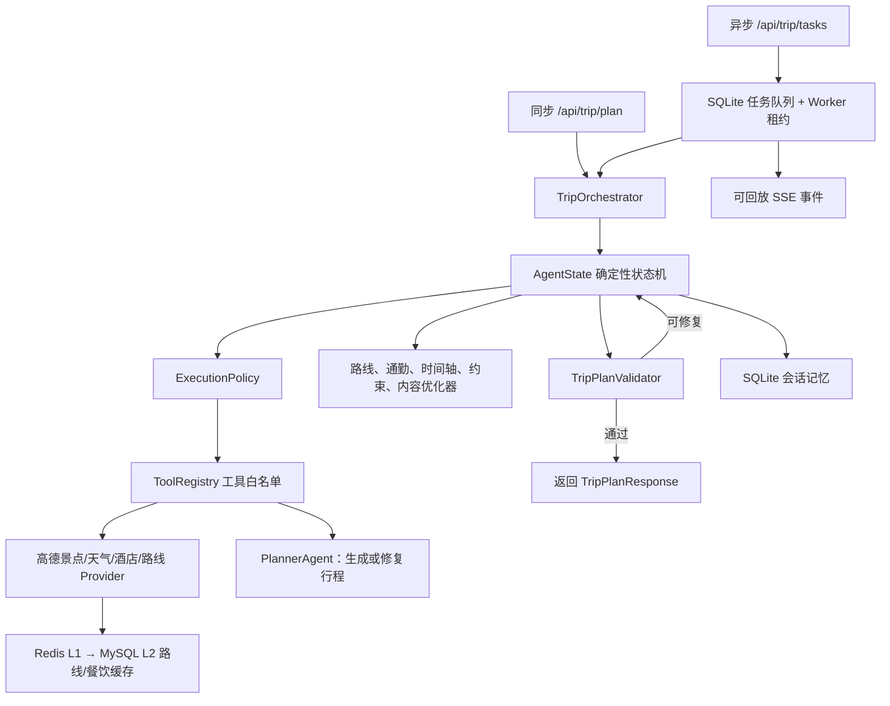

# 旅行规划智能体：现有能力与后续规划

## 1. 项目定位

本项目是一个基于 FastAPI 的旅行规划后端，也是一套**有状态、可恢复、有边界的确定性智能体运行时**。

它不是让 LLM 任意决定和执行命令的完全自主 Agent。当前架构把职责拆成两部分：

- **LLM**：负责首次生成结构化行程，以及在确定性校验无法直接修复时进行有限次数的行程修复。
- **确定性运行时**：负责状态决策、工具调用、路线评估、日程优化、约束修复、预算控制、缓存、记忆和审计。

这种设计优先保证稳定性、可解释性和可测试性，再逐步增加受约束的自主决策能力。

## 2. 总体架构

## 3. 一次规划请求的主要步骤

主流程位于 `app/agent_runtime/orchestrator.py`。每轮先根据 `AgentState` 选择一个物理根动作，再把后续连续的确定性本地动作压缩到同一物理步骤，并在该物理步骤结束后保存检查点。

1. 创建或恢复 `AgentState`，固化最大步骤、修复次数和执行预算。
2. 直接调用高德工具搜索景点、天气和酒店，不再为事实查询增加无必要的 LLM 调用。
3. 调用规划模型生成满足 `TripPlan` Schema 的初始行程。
4. 查询酒店与景点、景点与景点之间的高德真实路线。
5. 对路线完整性、不可用分段、总时长和总距离进行质量评分。
6. 路线质量较差时，用确定性候选排序优化景点顺序，并通过真实路线复验后决定接受或回滚。
7. 评估每一段通勤时长；过远时优先从本地候选池替换景点。
8. 本地候选不足时，根据前后地点计算搜索中心，动态调用高德周边搜索补充候选池。
9. 对补充候选执行标准化、去重、排序、裁剪，再次尝试近距离替换和真实路线复验。
10. 构建包含酒店出发、景点、用餐窗口和酒店返回的完整时间轴。
11. 发现每日超时时，执行有界跨日日程优化，并重新查询路线和评估时间轴。
12. 评估营业时间、天气、午餐窗口、每日景点软上限等可执行性约束。
13. 对可修复冲突执行确定性优化，并对修改后的行程重新评估。
14. 最终景点不足时，从附近未使用候选中回填，且不能引入已知日程失败。
15. 围绕最终酒店和景点锚点批量查询高德真实餐厅；相同坐标复用查询结果，并对锚点和候选数量做有界裁剪。
16. 根据最终酒店、景点、真实路线和餐厅候选重建描述、餐饮、交通说明和预算，消除派生内容不一致。
17. 执行确定性语义校验，并使用部分可接受策略检查核心结构、路线、时间轴、通勤和约束质量。
18. 完整校验通过时正常结束；仅剩白名单内非关键问题且质量分达标时带警告结束；否则才把结构化问题交给 LLM 做有限次数修复。
19. 返回行程、会话 ID、实际执行步数、完成模式、质量等级、质量分和未解决警告。

## 4. 已经具备的功能

### 4.1 API 与领域模型

- FastAPI 旅行规划接口：`POST /api/trip/plan`。
- 工具白名单查询：`GET /api/agent/tools`。
- 会话列表、详情和恢复接口。
- 状态跳转路径与完成率基线查询接口。
- 部分完成率、质量分、问题代码和资源消耗基线查询接口。
- 固定 15 场景清单、覆盖率和确定性验收结果查询接口。
- Pydantic 请求、行程、路线、时间轴、约束和响应模型。
- 阶段、步骤、尝试次数和会话 ID 都会进入错误信息，方便定位失败位置。

### 4.2 多协议 LLM 客户端

- OpenAI Responses API 协议。
- Anthropic Messages API 协议。
- 兼容部分中转网关的文本块和 `tool_use` 返回结构。
- JSON 提取、Markdown 代码块清理、TripPlan 结构校验和输出截断诊断。
- LLM 只承担生成与有限修复，不直接执行任意命令。

### 4.3 AgentState 与确定性循环

- 显式 `AgentAction` 状态机。
- 有最大步骤限制的循环执行，防止无限循环。
- 每个动作记录开始、成功、失败、耗时、错误类型和重试信息。
- 支持从 SQLite 最近检查点恢复，不重复已成功动作。
- 保存路线、评估报告、优化次数、内容指纹和动作历史。

### 4.4 执行循环收敛

- 对动作业务输入生成稳定 SHA-256 指纹，在消耗步骤和工具预算前阻断相同动作、相同输入的重复成功执行。
- 路线质量、单段通勤、时间轴、可执行性约束和最终校验分别维护完整评估输入指纹；只有依赖输入发生变化才重新评估。
- 对动作前后的核心业务状态生成指纹，统计连续成功但没有改变业务状态的无收益步骤，并在达到阈值时提前终止。
- 失败重试不计入重复动作和无收益次数，不干扰指数退避与熔断流程。
- 业务状态产生有效变化后开启新的收敛窗口，允许修复、回滚后合法地重新执行必要动作。
- 收敛原因、动作输入指纹、状态前后指纹和是否产生进展均写入 SQLite，支持恢复和复盘。
- 收敛终止通过 HTTP 409 返回明确的阶段、步骤、会话 ID 和原因。

### 4.5 状态跳转压缩

- `current_step` 只统计物理循环步骤，`action_history` 继续保存完整逻辑动作历史。
- HTTP 和 LLM 动作不能作为压缩子动作，必须开启新的物理步骤；外部动作成功后，路线、通勤、时间轴、约束、内容重建、校验和结束等确定性本地动作可以继续吸收到当前步骤。
- 每个压缩子动作仍保留独立 `ActionRecord`、输入指纹、状态前后指纹、收敛判断和尝试次数。
- 根动作记录本批次吸收的 `compressed_actions`；子动作记录根动作、批次序号和共享步骤号，便于 SQLite 恢复与复盘。
- 单个物理步骤最多吸收 `AGENT_MAX_LOCAL_ACTIONS_PER_STEP` 个本地动作，达到上限后由下一物理步骤继续，避免批次内部无限循环。
- 当前基础成功路径保留 10 个逻辑动作，但物理步骤已从 10 步压缩到 5 步，SQLite 常规检查点也按物理步骤写入。

### 4.6 状态跳转路径与完成率基线

- 只读统计接口：`GET /api/trip/analytics/execution-baseline`，不会调用高德、LLM 或修改会话。
- 支持按城市、会话状态和最近样本数量过滤，并返回匹配数、实际分析数、截断状态和无效旧检查点数量。
- 统计整体及各城市的完成率、平均物理步骤、平均逻辑动作和步骤压缩率。
- 统计每类动作的执行次数、覆盖会话数、成功/失败次数、压缩次数和平均耗时。
- 统计相邻动作跳转，并区分同一物理步骤内跳转和跨物理步骤跳转。
- 当动作序列再次回到旧动作时识别循环路径，可通过 `max_cycle_span` 控制最大循环跨度。
- 常见跳转和循环按出现次数排序，为后续“部分可接受结果”策略提供可量化依据。
### 4.7 ToolRegistry 与统一 ActionResult

- 工具必须先注册到白名单才能执行。
- 统一输入校验、输出校验、异常分类和安全错误信息。
- 工具声明自身 LLM 调用成本，运行时统一扣减预算。
- 当前白名单包含：景点搜索、周边候选补搜、天气查询、酒店查询、真实路线查询、行程生成和行程修复。

### 4.8 执行安全与容错

- 总执行时长预算。
- 工具调用次数预算。
- LLM 调用次数预算。
- HTTP 连接超时和读取超时。
- 指数退避与随机抖动。
- 按工具隔离的线程安全 CircuitBreaker。
- 鉴权、参数等不可恢复错误不会被无意义重试。

### 4.9 高德地图工具层

- 地点搜索 2.0 关键词搜索和周边搜索。
- 景点、酒店、通用 POI 与真实餐厅搜索。
- 按 POI ID 查询地点详情。
- POI 搜索优先、地理编码回退的地点解析。
- 天气查询。
- 周边 POI 动态补充搜索。
- Route Planning 2.0 真实路线查询。
- 公交路线所需 citycode 解析。
- Provider 原始输出标准化、无效项过滤、去重、排序和裁剪。
- 相同餐饮坐标复用一次 HTTP 结果，锚点、候选和半径均有配置上限。
- 路线分段失败时保留其他成功分段，不因单段失败丢弃整份路线结果。

### 4.10 SQLite 记忆与缓存

- 完整 `AgentState` 检查点持久化。
- SQLite `locked/busy` 检查点错误独立有限重试；重试耗尽后抛出类型化 `AgentCheckpointError`，不把未持久化结果伪装成成功。
- 会话查询、恢复和复盘。
- 动作历史、错误历史和验证历史保存。
- 标准化路线结果 SQLite 缓存。
- 正常路线与不可用路线使用不同 TTL，减少重复请求并避免长期缓存临时故障。

### 4.11 路线质量与优化

- 高德真实路线质量评分。
- 酒店出发和返回路线。
- 不可用分段、总路程、总时长和完整率评估。
- Haversine 生成候选顺序，真实路线负责最终验收。
- 优化结果没有达到最小改善阈值时自动回滚。

### 4.12 单段通勤约束

- 按步行、公共交通和驾车分别配置最大单段通勤时间。
- 定位具体超限分段和目标景点。
- 根据前后锚点选择距离更近的未使用景点。
- 本地候选不足时动态扩大高德周边搜索半径。
- 替换后重新查询真实路线、时间轴和可执行性约束，失败则回滚。

### 4.13 时间轴与日程优化

- 完整地点时间轴：酒店出发、景点、午餐、晚餐和酒店返回。
- 游览时间、真实通勤时间和缓冲时间统一计算。
- 每日超时和不可执行日期识别。
- 有界跨日移动优化。
- 优化后重新进行路线和约束评估。

### 4.14 可执行性约束与内容一致性

- 日期和天数一致性。
- 景点来源和重复项检查。
- 营业时间、天气、用餐窗口和每日景点数量检查。
- 最低景点数量保障与附近候选回填。
- 时间轴会在长景点或路线跨过最迟开餐时间前确定性插入午餐，并保证完整午餐区间落在配置窗口内。
- 内容重建会把旧状态中的越界午餐裁剪回统一窗口，时间轴、餐饮选择和约束评估共用同一配置。
- 最终地点稳定后查询真实餐厅，地点变化会通过餐饮锚点指纹触发重新查询。
- 描述、真实餐饮、交通和预算根据最终行程重新构建。
- 交通文案显式声明的主交通方式优先于后续分段描述，避免混合路线文本改变路线输入指纹。
- 同一天避免重复餐厅；真实候选缺失时显式标记 `fallback`。
- 使用内容源指纹避免无意义重复重建，并保护内容重建前后的路线输入一致性。

### 4.15 测试覆盖

- 测试覆盖高德 POI v5 传输、地点与餐饮标准化、真实餐厅闭环、工具注册、执行策略、会话记忆、路线缓存、路线优化、通勤替换、时间轴优化、约束修复、内容回填、规划模型解析、执行循环收敛、状态跳转压缩、执行基线聚合、固定录制回放、防篡改校验、可恢复故障和不可恢复安全终止。
- 截至 2026-08-20，本地完整单元测试为 343/343 通过，另有 9 项环境相关测试跳过。
- Orchestrator 故障恢复与安全终止基线为 14/14 通过，其中可恢复 7/7、安全终止 7/7。
- Live Provider 基线已覆盖 15/15 个固定场景且全部可离线回放；当前达到业务质量阈值的场景为 5/15。

### 4.16 部分可接受结果策略

- 每次最终校验后使用确定性策略生成 `PartialAcceptanceReport`，不额外调用 LLM。
- 最终结果分为 `excellent`、`acceptable`、`degraded` 和 `unusable` 四个等级，并计算稳定的 0～100 质量分。
- 城市、日期、天数、每日最低景点数、真实路线可用性、日程超时、单段通勤和可执行性约束属于核心检查，不能被普通警告绕过。
- 只有错误数量不超过上限、错误代码全部位于白名单且综合质量分达标时，才允许 `partial` 模式完成。
- 默认只允许 `plan.empty_suggestions` 和受阈值限制的 `schedule.daily_overtime` 降级交付；不可用路线、过长通勤和约束错误默认仍会阻断完成。
- 部分完成会跳过无收益的 LLM 修复循环，同时在 `ActionRecord` 中保留原始校验错误数量。
- `AgentState` 和 SQLite 检查点保存完成模式、质量报告及警告，恢复会话后仍可查询和复盘。
- `TripPlanResponse` 返回 `completion_mode`、`quality_level`、`quality_score` 和 `warnings`，前端可以明确展示降级原因。

### 4.17 故障恢复与安全终止基线

- 使用真实 `TripOrchestrator`、`ExecutionPolicy`、`ToolRegistry`、SQLite 和确定性优化器执行完整验收，仅替换高德与 Planner 外部边界。
- 7 类可恢复场景覆盖首次超时、429、首次无效输出、SQLite 短暂锁定、路线分段首次失败，以及路线缓存和餐饮缓存持续失败后的无缓存降级。
- 7 类不可恢复场景覆盖鉴权失败、连续无效模型输出、SQLite 会话检查点连续锁定、路线持续不可用、长通勤无法替换、日程超时无法优化和景点候选耗尽。
- 缓存属于可降级依赖；会话检查点属于关键持久化依赖，两者采用不同的失败语义。
- 不可恢复场景必须在预算内明确失败，不能拖到最大步骤、预算耗尽或收敛终止。
- 每个场景生成稳定 `termination_code`、结构化问题代码、实际故障事件、动作次数和资源消耗。
- `scripts/run_orchestrator_fault_recovery.py` 可输出 JSON 与 JUnit XML；质量门默认写入 `build/reports/`。
- 2026-08-13 最新结构化报告为 14/14 通过，总通过率 100%。

### 4.18 异步任务、真实进度与断线恢复

- `POST /api/trip/tasks` 只持久化任务并返回 HTTP 202，不在请求线程调用高德或 LLM。
- SQLite 保存任务快照和自增事件，页面刷新或浏览器断线后可通过 task ID 和事件游标恢复。
- SSE 支持 `Last-Event-ID` 与 `after_event_id`，前后端双重按 event ID 去重。
- 支持取消排队中和执行中任务；每次工具调用、动作循环和退避等待前都会检查取消。
- Worker 使用原子领取、租约和心跳避免重复执行；失去租约的旧 Worker 不能继续写进度或覆盖终态。
- 服务重启后，以同一 session ID 从最近 AgentState 检查点恢复未完成任务。
- 成功任务保存 `result_session_id`，前端自动跳转 `/result/:sessionId`。
- 失败和超时任务返回可展示的结构化故障报告。
- 原同步规划接口及第四阶段 TripDraft/TripPlanVersion 功能继续兼容。
- 详细设计、API 和运维边界见 `docs/async-task-runtime.md`。

## 5. 当前边界与已知问题

1. **跨外部调用的循环仍可能增加步骤**：状态跳转压缩已经合并连续本地评估，部分可接受策略也能在只剩非关键问题时提前完成；但“替换景点 → 查询真实路线 → 复验 → 再优化”等包含高德调用的核心质量循环仍必须占用独立物理步骤。
2. **还不是真正的 LLM 自主规划器**：当前自主性来自确定性状态机。这样更安全，但不能根据复杂上下文灵活选择新策略。
3. **真实餐厅已经接入，但交易和实时状态尚未闭环**：项目能够按最终地点查询高德餐厅并重建餐饮与预算，但尚未接入实时排队、临时停业、订座、套餐价格和饮食禁忌数据源。
4. **费用是估算值**：门票、酒店、餐饮和交通价格仍需更可靠的数据源与价格时间戳。
5. **天气属于查询时快照**：远期旅行日期可能没有可靠预报，应显式区分预报、历史气候和未知状态。
6. **质量指标已有统一基线，但还没有生产监控面板**：SQLite 已能统计完整/部分完成率、质量分、问题代码、步骤和模型消耗；仍需 OpenTelemetry、告警和可视化。
7. **Live 验收链路完整，但真实业务质量尚未全部达标**：15 个 `live` 样本已经 100% 覆盖并通过 manifest/摘要校验，当前只有 5/15 达到固定质量阈值；主要缺口是每日最低景点、过长单段通勤和个别路线不可用。
8. **当前 Worker 仍与 FastAPI 同进程部署**：SQLite 租约已支持多进程互斥和重启恢复，但大规模并发时仍应拆分独立 Worker 服务，并增加用户级限流、容量控制和队列运维。

## 6. 后续工作计划

### 阶段一：压缩执行步骤并提高完成率（最高优先级）

目标：解决“达到最大执行步数仍未完成”的问题，而不是单纯继续增大 `AGENT_MAX_STEPS`。

已完成：

- 已为路线、通勤、时间轴、约束和最终校验建立完整评估输入指纹，输入未变化时不重复评估。
- 已阻断同一收敛窗口内“相同动作 + 相同业务输入”的重复成功执行。
- 已通过业务状态前后指纹识别连续无收益动作，并在达到阈值时提前终止。
- 已将收敛历史持久化到 SQLite；失败重试不计入收敛次数，合法修复和回滚会开启新窗口。
- 已把连续确定性本地动作压缩到同一物理步骤，同时保留每个逻辑动作的审计、收敛记录和 SQLite 恢复能力。
- 已从 SQLite `action_history` 建立动作次数、相邻跳转、常见循环、城市完成率和平均物理步骤基线，并提供只读查询 API。

下一步：

- 使用已经完成的 15 个 Live 样本基线持续调整各城市、天数和交通方式的优化策略，但不通过放宽核心阈值掩盖真实问题。
- 优先修复 7 个“每日最低景点不足”场景，使候选回填、跨日重排和内容一致性重建能够稳定收敛。
- 对 4 个“单段通勤过长”场景补强近距离替换和候选池动态搜索；对 1 个路线不可用场景完善分段降级与可解释结果。

验收指标：典型 3 日行程在物理步骤预算内稳定完成；没有重复输入的同类评估动作；逻辑动作审计数量不因压缩而减少；Live 固定基线通过率持续提升。

### 阶段二：端到端可观测性（质量基线已完成）

已完成：

- SQLite 会话表新增旅行天数、交通方式、完成模式、质量等级、质量分、问题代码、工具调用、LLM 调用和总耗时冗余列，并自动迁移、回填旧数据库。
- 可统计完整完成率、部分完成率、失败率、平均质量分、平均物理步骤、逻辑动作、工具调用、LLM 调用和总耗时。
- 可按城市、旅行天数、交通方式、完成模式和质量等级筛选或分组。
- 可统计常见问题代码，以及部分接受策略估算节省的 LLM 修复调用和物理步骤。
- 新增只读接口 `GET /api/agent/analytics/quality-baseline`。

下一步：

- 增加结构化日志和 request/session 关联 ID。
- 增加路线缓存命中率、候选池增量、熔断器状态和优化器接受/回滚指标。
- 接入 OpenTelemetry、告警和可视化面板。

### 阶段三：固定质量评测体系（基础设施已完成，Live 质量整改中）

已完成：

- 固定杭州、北京、上海、成都、西安五个城市，共 15 个不可漂移场景。
- 每个城市覆盖 1 日步行、3 日公共交通和 5 日驾车，并覆盖自然、人文、亲子、美食和休闲偏好。
- 固定场景从 2026 年 10 月 12 日开始，避免使用 2026 年 8 月 12 日之前的历史日期。
- 确定性检查完成状态、完成模式、质量分、日期和天数、每日最低景点、路线可用性、单段通勤、时间轴超时、约束错误、物理步骤和 LLM 调用预算。
- 新增 `GET /api/agent/analytics/fixed-acceptance-scenarios` 和 `GET /api/agent/analytics/fixed-acceptance-baseline`。
- 录制文件升级为版本化包，包含 `manifest.json`、场景来源、请求摘要、状态摘要和递归脱敏路径。
- 回放时校验场景、SHA-256、manifest 和样本来源，同时兼容旧版裸 `AgentState`。
- 仓库内提供 15 个明确标记为 `synthetic` 的离线契约样本，用于验证格式、覆盖率和质量门，不伪装成真实 Provider 数据。
- 15 个 `live` Provider 样本已经全部录制，manifest 中来源均为 `live`，覆盖率 100%，无缺失或无效样本。
- 2026-08-13 离线回放结果为 5/15 达到固定质量阈值；失败分布为最低景点数 7 个、过长通勤 4 个、路线不可用 1 个。
- 故障注入支持高德/LLM 工具超时、上游失败、429、鉴权失败、无效输出和 SQLite 锁定，并记录实际触发事件。
- `scripts/run_quality_gate.py` 和 GitHub Actions 会执行编译、全量测试及 15 个 synthetic 场景离线回放，缺失或失败场景会使构建失败。
- 完整 Orchestrator 故障安全验收使用真实运行时、工具注册表、执行策略、SQLite 和确定性优化器，覆盖 7 类可恢复故障和 7 类不可恢复安全终止场景。
- 长通勤无法替换、日程超时无法优化，以及路线/餐饮缓存持续读写失败均已进入固定故障基线。
- 结构化故障报告同时输出 JSON 与 JUnit XML，记录恢复率、终止率、异常类型、终止代码、问题代码、故障事件和预算消耗，并接入本地及 CI 质量门。

下一步：

- 不降低核心检查标准，逐项修复 Live 回放中 `plan.minimum_attractions`、`commute.segment_limit` 和 `route.available` 失败。
- 建立真实样本定期刷新、人工脱敏复核、供应商/模型版本登记和协议版本升级流程。
- 在发布前同时报告“样本覆盖率”和“业务质量通过率”，禁止用 100% 覆盖率代替质量结论。

### 阶段四：真实餐饮、价格和开放时间数据（第一阶段已完成）

已完成：

- 地点搜索 2.0、通用 POI、POI 详情和地点解析工具。
- 真实餐厅搜索、标准化模型和有界餐次锚点查询。
- AgentState 餐饮状态、搜索指纹、确定性动作和 SQLite 恢复兼容。
- 内容重建优先使用真实餐厅，无结果时显式回退。
- 根据完整地点时间轴推导早餐、午餐、晚餐预计到店区间。
- 已知营业时间的餐厅必须完整覆盖预计用餐区间；明确关闭时自动选择其他候选或回退。
- 约束评估器新增 `meal.outside_opening_hours` 可修复错误。
- 餐饮周边查询使用独立 SQLite 快照缓存，并通过 6 小时 TTL 控制数据新鲜度。
- 缓存只保存与行程无关的 POI，读取后重新绑定餐次锚点，支持跨会话安全复用。

下一步：

- 预算条目携带来源、查询时间和可信度。
- 接入饮食禁忌、儿童餐、排队和预订等可选数据源。
- 对远期天气明确返回“尚无可靠预报”，避免把当前天气当作未来天气。

### 持久化演进：Store 抽象、MySQL Store、历史迁移与正式切换（阶段一至五已完成）

阶段一已完成：

- 使用 SQLite Online Backup API 对 `data/agent_memory.db` 创建一致性备份，并生成完整性检查和 SHA-256 manifest。
- 新增数据库后端无关的 `AgentStateStore`、`TripVersionStore`、`TripTaskStore`、`RouteCacheStore` 和 `RestaurantCacheStore`。
- Orchestrator、TripDraftService、TripTaskWorker 和任务执行上下文不再直接依赖 SQLite 具体类。
- 新增统一 Store 工厂，业务层不再自行创建数据库具体实现。
- 会话、草稿版本、异步任务和缓存异常统一为数据库后端无关异常，同时保留旧导入路径兼容。

阶段二已完成：

- 接入 SQLAlchemy、PyMySQL 和 Alembic，并通过 `.env` 管理连接池、超时和数据库名称。
- 定义 `agent_sessions`、两张缓存表、草稿/版本表、任务表和 SSE 事件表共七张 MySQL 业务表。
- 大型 JSON 使用 `LONGTEXT`，时间使用 `DATETIME(6)`，表统一使用 InnoDB、utf8mb4 和 `utf8mb4_unicode_ci`。
- 提供开发/测试数据库初始化、Alembic 在线迁移、离线 SQL、连接健康检查和物理 Schema 对比工具。
- MySQL Schema 由 Alembic 管理，七张业务表、索引、唯一约束和事件外键均纳入自动校验。

阶段三已完成：

- 实现 AgentState、路线缓存、餐饮缓存、行程版本和异步任务五类 MySQL Store。
- Store 工厂已支持 `DATABASE_BACKEND=sqlite` 和 `DATABASE_BACKEND=mysql`，SQLite 继续作为回滚后端。
- Worker 使用 `FOR UPDATE SKIP LOCKED` 排他领取，任务快照与 SSE 事件原子提交。
- 任务创建支持幂等键、请求指纹和并发双击去重；过期租约恢复、取消阻止领取和旧 Worker 拒绝均已覆盖。
- 已通过真实 MySQL 五类 Store 契约、缓存 TTL、版本确认和多 Worker 并发测试。

阶段四已完成：

- 增加 SQLite → MySQL 的 dry-run、execute、verify、断点恢复和安全 rollback。
- execute 自动创建不可变 SQLite 快照和 SHA-256 manifest，不直接迁移正在变化的 WAL 数据库。
- 迁移按主键幂等写入，不覆盖 MySQL 已有冲突记录。
- 新增迁移批次与逐行凭证表；rollback 只删除本批次插入且此后未被修改的数据。
- verify 使用完整行摘要，只有 `safe_to_cutover=true` 才允许切换后端。
- 2026-08-20 本地开发库已迁移并逐行验证 399 条历史记录；测试库完成 399 条 execute → verify → rollback 演练。

阶段五已完成：

- 为本地 `travel_agent_app` 配置最小业务读写权限；管理员密码只在交互式终端读取，应用密码仅写入被 Git 忽略的 `.env.local`，并覆盖 IDE/父进程中的陈旧变量。
- 最终一致性快照迁移批次逐行验证 399/399，`safe_to_cutover=true`。
- 本地运行配置已切换为 `DATABASE_BACKEND=mysql`，五类 Store 均通过 MySQL 工厂加载。
- API/Worker 已通过历史会话、execution-view、任务查询、202 创建、幂等、取消、SSE 回放和重启验收。
- MySQL 专用 Schema、Store、租约恢复和多 Worker 并发测试通过；SQLite 继续保留为回滚后端。

Redis 阶段一至第三阶段业务增强已完成：

- 新增 Redis 可选配置、线程安全连接池、连接/命令超时和应用关闭清理。
- Redis 连接失败时进入短暂冷却并返回调用方 fallback，不中断 MySQL/SQLite 主链路。
- 建立统一 Key 前缀、可信标识符校验和复杂查询 SHA-256 摘要规则，避免在 Key 中暴露地址与偏好原文。
- 实现数据库后端无关的 `CacheStore` 协议，以及 `RedisCacheStore`、`NoOpCacheStore` 和配置工厂。
- 缓存统一使用版本化 UTF-8 JSON 信封和 TTL 边界，禁止 pickle、NaN 和任意对象反序列化。
- 高德路线与餐饮候选已按 Redis L1 → MySQL L2 → Provider 接入，并统计 L1/L2 命中率、Provider 调用和节省次数。
- Redis Pub/Sub 已承担 Worker 新任务通知、取消广播和 SSE 事件唤醒；MySQL 仍是任务、事件、取消和租约的唯一事实来源。
- 跨进程通知、多 Worker 互斥、Redis 故障恢复、SSE/取消回放 4/4 真实验收通过。
- `/metrics` 和 `/api/observability/redis` 已提供 Prometheus、可选 OpenTelemetry、连接池、降级、通知和结构化告警。
- 提供 Prometheus 抓取与告警规则、OpenTelemetry Collector 示例和无高德/LLM 的 Redis 并发压力脚本。
- 本机 20 并发压力基线将连接池从 20 调整为 32；3000 条命令零错误，Pub/Sub 接收率 100%，Worker/SSE 兜底间隔保持 5 秒。
- Redis Lua 已提供跨 API/Worker 实例的原子固定窗口限流，高德使用全局每秒/分钟/每日额度，LLM 使用按模型摘要隔离的每分钟/每日请求额度。
- 天气、景点、周边景点、酒店、地理编码、通用 POI 和 POI 详情已接入标准化 Redis 热缓存；缓存损坏或 Redis 故障时透明回源高德。
- execution-view 与异步任务最新进度已接入 Redis 只读快照；AgentState、任务、取消、租约和 SSE 事件仍由数据库保存真相。
- 新增 Provider 配额和高德业务缓存 Prometheus 指标，以及不调用真实高德/LLM 的跨进程额度与故障恢复验收。

下一步：

- 在用户认证体系完成后增加用户级/租户级配额，并补充 LLM token 与成本预算；当前已完成供应商级和模型级请求次数配额。
- 在真实多实例部署中接入 Prometheus/Alertmanager/OTel Collector，并按长期指标继续校准容量与配额。
- 将内置 Worker 拆为独立部署单元，完成多实例 API + 多 Worker 的容量和故障切换验收。
- 进入用户长期记忆与受约束 LLM 自主决策前，先完成身份归属、隐私保留、记忆摘要和可撤销策略。

### 阶段六：受约束的自主决策层

在确定性工具层和评测体系稳定后，再增加 LLM Planner/Coordinator：

- 只能从 ToolRegistry 白名单中选择动作。
- 输出必须符合结构化决策 Schema。
- 不能直接修改 AgentState，只能提交候选动作和理由。
- 不能绕过步骤、时间、工具或 LLM 预算。
- 确定性状态机始终作为安全兜底。
- 对每次决策记录依据、置信度、结果和是否回滚。

### 阶段七：生产化能力

- 异步任务运行时已完成；下一步拆分独立 Worker 进程并增加队列运维接口。
- API 鉴权、用户级配额和限流。
- 密钥只存服务端环境或密钥管理系统，并建立轮换流程。
- 数据库迁移、备份、清理和隐私保留策略。
- OpenTelemetry、Redis 错误告警和容量测试已完成第一版；后续扩展到全链路追踪与业务 SLO。

## 7. 配置建议

- 新环境从 `.env.example` 复制配置，但不要提交真实 `.env`。
- 当前复杂行程建议 `AGENT_MAX_STEPS=40`；若本地 `.env` 仍为 24，需要显式更新并重启服务。
- 3～5 日且包含路线重算、餐饮回填和自动修复的行程建议至少使用 `AGENT_MAX_DURATION_SECONDS=600`、`AGENT_MAX_TOOL_CALLS=30`；15 次工具预算只适合较短、无需多轮优化的行程。
- 调高步骤上限时同步检查 `AGENT_MAX_DURATION_SECONDS`、`AGENT_MAX_TOOL_CALLS` 和 `AGENT_MAX_LLM_CALLS`，否则可能先触发其他预算。
- `AGENT_MAX_REPEATED_ACTION_INPUTS=1`：同一收敛窗口内，相同动作和业务输入最多成功执行一次。
- `AGENT_MAX_NO_PROGRESS_STEPS=3`：连续三个成功动作没有改变核心业务状态时提前终止，避免耗尽全部步骤。
- `AGENT_MAX_LOCAL_ACTIONS_PER_STEP=8`：单个物理步骤最多吸收八个确定性本地动作；调低可获得更细检查点，调高可减少物理步骤。
- `TRIP_TASK_LEASE_SECONDS=30`、`TRIP_TASK_HEARTBEAT_SECONDS=5`：租约必须明显长于心跳；异常重启后会等待旧租约过期再恢复。
- `TRIP_TASK_SSE_POLL_SECONDS=0.5`、`TRIP_TASK_SSE_HEARTBEAT_SECONDS=15`：控制事件读取频率和代理保活。
- API Key 曾在对话或日志中暴露时，应立即在服务端吊销旧 Key、生成新 Key、更新本地环境并重启服务。
